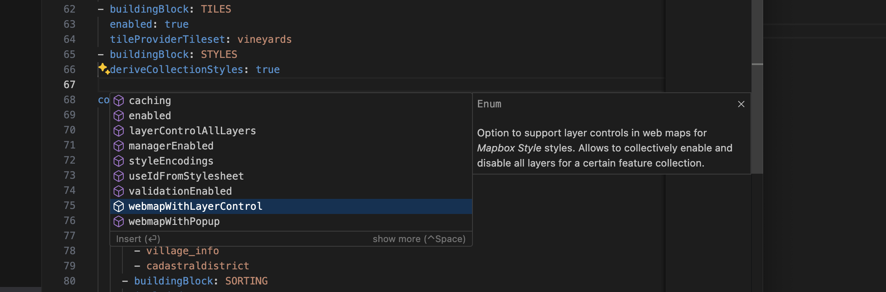

# Editor

A [VS Code](https://code.visualstudio.com) extension that supports you in creating and updating [ldproxy](https://docs.ldproxy.net) configurations.

## Current state

The first stable release (`v1.0.0`) is available.

### Distribution

Currently the only way to use the extension is the provided docker image that contains an open source version of VS Code for the Web.

### Features

- Command `Create new entities`: provides a graphical wizard to automatically generate provider and service configurations from data sources.
- IntelliSense: shows available properties in YAML configuration files.
- Syntax checks: detects unknown or deprecated properties in YAML configuration files.
- Tooltips: shows documentation for properties in YAML configuration files.

## Outlook

- `v1.1.0` automatically generate and edit MapLibre styles
- `v2.0.0` general availability of the extension for VS Code Desktop (macOS, Windows, Linux)

## Installation

The docker image is available at `ghcr.io/ldproxy/editor`. It expects the workspace to be mounted at `/data`. The application runs on port `80`.

To start the editor with your ldproxy configuration directory in `/home/user/ldproxycfg` and access it at `http://localhost:8080`:

```sh
docker run -d -p 8080:80 -v /home/user/ldproxycfg:/data ghcr.io/ldproxy/editor
```

> [!NOTE]
> Accessing the editor via `http` only works with `localhost`. If you want to setup an editor for remote access, you need a reverse proxy which provides `https`.

## Usage

When you open the application at `http://localhost:8080` in the browser, you will see the mounted ldproxy configuration directory on the left. You can now start to edit your files.

For general help, check the documentation for [VS Code](https://code.visualstudio.com/docs).

### Creating new entities

When you open the [command palette](https://code.visualstudio.com/docs/getstarted/userinterface#_command-palette) and start typing `ldproxy`, the command `ldproxy: Create new entities` should appear at the top. Upon selecting, the graphical wizard will open in a new tab.

It allows you to automatically generate provider and service configurations from _PostgreSQL/PostGIS_, _GeoPackage_ and _WFS_ data sources.

> [!NOTE]
> When trying to access a _PostgreSQL_ database on the same host where the docker container is runnning, you have to use `host.docker.internal` instead of `localhost`.


### IntelliSense (autocompletion)

To get a list of all available properties in a certain place in a YAML configuration file, you can press `Ctrl+Space`. (It is called `Trigger suggest` in the [command palette](https://code.visualstudio.com/docs/getstarted/userinterface#_command-palette), which also shows the configured hotkey.)
You can then use the cursor keys to navigate the suggestions and choose one with `Enter`. You might also start typing before or after triggering to narrow the suggestions.


