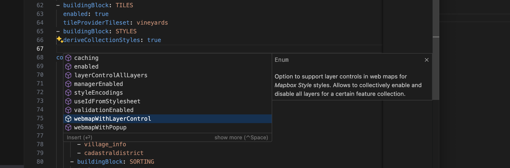
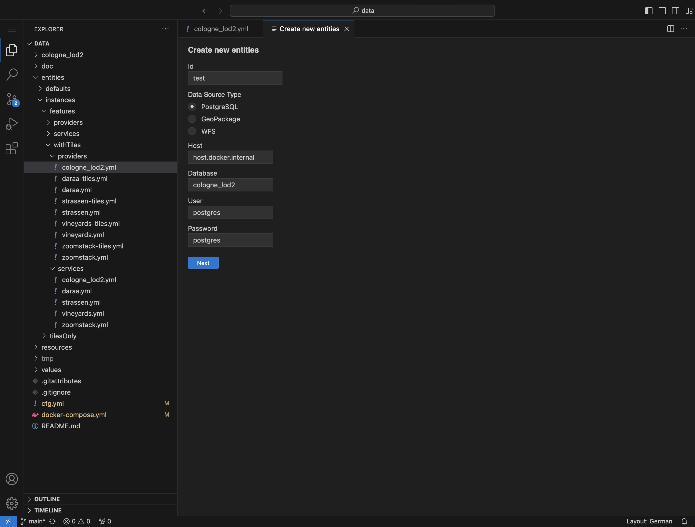
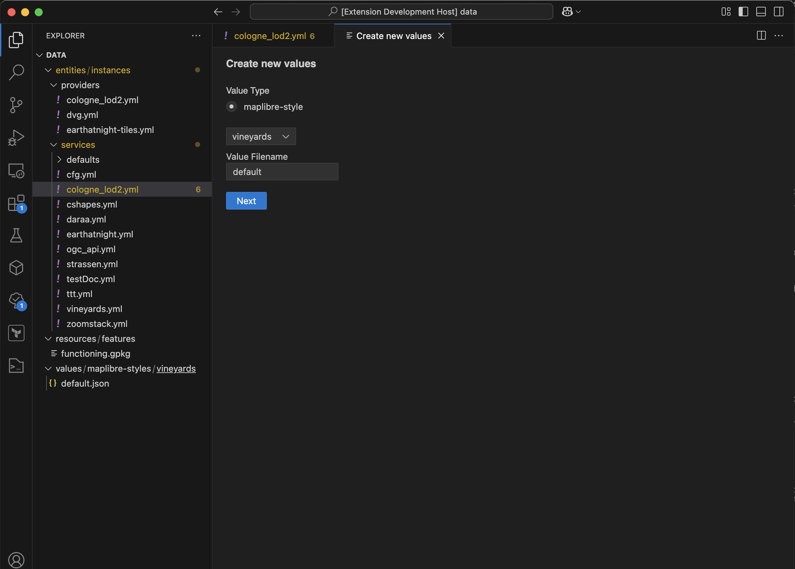

# ldproxy for VS Code

A [VS Code](https://code.visualstudio.com) extension that supports you in creating and updating [ldproxy](https://docs.ldproxy.net) configurations.

## Current state

- The current stable release is `v1.1.0`.
- It is available as a pre-release on the VS Code Marketplace (currently only for macOS and Linux).
- It can be used as a web application with the docker image that contains an open source version of VS Code for the Web.

### Features

- Command `Create new entities`: provides a graphical wizard to automatically generate provider and service configurations from data sources.
- Command `Create new values`: provides a graphical wizard to automatically generate value configurations, currently only MapLibre styles.
- IntelliSense: autocompletion, shows available properties in YAML configuration files.
- Syntax checks: detects unknown or deprecated properties in YAML configuration files.
- Tooltips: shows documentation for properties in YAML configuration files.

### Limitations

- The extension is not yet available for Windows, only MacOS and Linux are supported for now.
- The workspace root needs to be a ldproxy store directory for the extension to work properly. Parent directories that contain multiple store directories are not yet supported, and neither are multi-root workspaces.
- Tile Providers cannot be generated yet.

### Outlook

- `v2.0.0` general availability of the extension for VS Code Desktop (macOS, Windows, Linux), no known limitations

## Installation

### VS Code Desktop

Open the extensions view from the activity bar and search for _ldproxy_, then install the extension _ldproxy for VS Code_. [This](https://marketplace.visualstudio.com/items?itemName=iide.ldproxy-editor) is a direct link to the extension on the VS Code Marketplace.

When installed, you may open a ldproxy store directory in VS Code, for example by using `File -> Open Folder` or by calling `code` in a terminal. You can then start editing your files.

### Docker

The docker image is available at `ghcr.io/ldproxy/editor`. It expects the workspace to be mounted at `/data`. The application runs on port `80`.

To start the editor with your ldproxy configuration directory in `/path/to/ldproxy/cfg` and access it at `http://localhost:8080`:

```sh
docker run -d -p 8080:80 -v /path/to/ldproxy/cfg:/data ghcr.io/ldproxy/editor
```

When you open the application at `http://localhost:8080` in the browser, you will see the mounted ldproxy configuration directory on the left. You can now start to edit your files.

> [!NOTE]
> Accessing the editor via `http` only works with `localhost`. If you want to setup an editor for remote access, you need a reverse proxy which provides `https`.

## Usage

Unknown or deprecated properties will automatically be marked in open files. Hovering over a property will show the documentation.

For general help, check the documentation for [VS Code](https://code.visualstudio.com/docs).

### IntelliSense (autocompletion)

To get a list of all available properties in a certain place in a YAML configuration file, you can press `Ctrl+Space`. (It is called `Trigger suggest` in the [command palette](https://code.visualstudio.com/docs/getstarted/userinterface#_command-palette), which also shows the configured hotkey.)
You can then use the cursor keys to navigate the suggestions and choose one with `Enter`. You might also start typing before or after triggering to narrow the suggestions.



### Creating new entities

When you open the [command palette](https://code.visualstudio.com/docs/getstarted/userinterface#_command-palette) and start typing `ldproxy`, the command `ldproxy: Create Configuration` should appear at the top. Upon selecting, the graphical wizard will open in a new tab.

It allows you to automatically generate provider and service configurations from _PostgreSQL/PostGIS_, _GeoPackage_ and _WFS_ data sources.

> [!NOTE]
> When trying to access a _PostgreSQL_ database on the same host where the docker container is runnning, you have to use `host.docker.internal` instead of `localhost`.



### Creating new values

When you open the [command palette](https://code.visualstudio.com/docs/getstarted/userinterface#_command-palette) and start typing `ldproxy`, the command `ldproxy: Create new values` should appear near the top. Upon selecting, the graphical wizard will open in a new tab.

It currently only allows you to automatically generate a MapLibre style from a service configuration.


